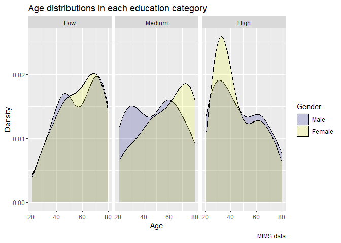
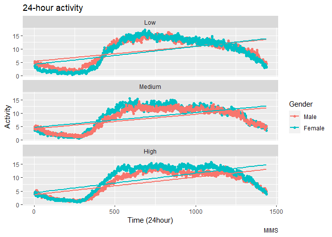

p8105_hw3_zq2227.Rmd
================
Zixuan Qiu zq2227
2023-10-08

# Problem 1

``` r
library(tidyverse)
```

    ## ── Attaching core tidyverse packages ──────────────────────── tidyverse 2.0.0 ──
    ## ✔ dplyr     1.1.3     ✔ readr     2.1.4
    ## ✔ forcats   1.0.0     ✔ stringr   1.5.0
    ## ✔ ggplot2   3.4.3     ✔ tibble    3.2.1
    ## ✔ lubridate 1.9.2     ✔ tidyr     1.3.0
    ## ✔ purrr     1.0.2     
    ## ── Conflicts ────────────────────────────────────────── tidyverse_conflicts() ──
    ## ✖ dplyr::filter() masks stats::filter()
    ## ✖ dplyr::lag()    masks stats::lag()
    ## ℹ Use the conflicted package (<http://conflicted.r-lib.org/>) to force all conflicts to become errors

``` r
library(p8105.datasets)
data("instacart")
```

``` r
aislesnumber<-instacart |>
  group_by(aisle) |># groups the instacart dataset by aisle.
  summarize(number = n())|>#count the number of order in each aisle.
  arrange(desc(number))
```

``` r
aislesnumber
```

    ## # A tibble: 134 × 2
    ##    aisle                         number
    ##    <chr>                          <int>
    ##  1 fresh vegetables              150609
    ##  2 fresh fruits                  150473
    ##  3 packaged vegetables fruits     78493
    ##  4 yogurt                         55240
    ##  5 packaged cheese                41699
    ##  6 water seltzer sparkling water  36617
    ##  7 milk                           32644
    ##  8 chips pretzels                 31269
    ##  9 soy lactosefree                26240
    ## 10 bread                          23635
    ## # ℹ 124 more rows

\#There are 134 aisles and the fresh vegetables are the most items
ordered from.

``` r
aisleplot<-aislesnumber|>
  filter(number>10000)|>
  ggplot(aes(x = reorder(aisle, number), y = number)) + #arrange the aisle by the number of items
  geom_bar(stat = "identity")+
  coord_flip()+ # display the aisle name horizontal
  labs(
    title = "Number of items ordered in each aisle ",
    x = "Number of ordered",
    y = "Aisle",
    caption = "Data from the instcart")

aisleplot
```

<!-- -->

``` r
ggsave("Item_number_in_aisle.png",plot =aisleplot )
```

    ## Saving 7 x 5 in image

``` r
popular_items<-instacart|>
  filter(aisle %in% c("baking ingredients", "dog food care","packaged vegetables fruits"))|>
  group_by(aisle,product_name)|>
  summarize(ordered_number= n())|>
  arrange(aisle, desc(ordered_number))|>
  slice_head(n = 3)|>
  knitr::kable(digits = 1)
popular_items
```

| aisle                      | product_name                                  | ordered_number |
|:---------------------------|:----------------------------------------------|---------------:|
| baking ingredients         | Light Brown Sugar                             |            499 |
| baking ingredients         | Pure Baking Soda                              |            387 |
| baking ingredients         | Cane Sugar                                    |            336 |
| dog food care              | Snack Sticks Chicken & Rice Recipe Dog Treats |             30 |
| dog food care              | Organix Chicken & Brown Rice Recipe           |             28 |
| dog food care              | Small Dog Biscuits                            |             26 |
| packaged vegetables fruits | Organic Baby Spinach                          |           9784 |
| packaged vegetables fruits | Organic Raspberries                           |           5546 |
| packaged vegetables fruits | Organic Blueberries                           |           4966 |

``` r
mean_hour<-instacart|>
  filter(product_name %in% c("Pink Lady Apples", "Coffee Ice Cream","packaged vegetables fruits"))|>
  group_by(product_name,order_dow)|>
  summarise(meanhour=mean(order_hour_of_day))|>
  pivot_wider( names_from = "order_dow", values_from = "meanhour")|>
  rename("Sunday" =`0`,"Monday" =`1`,"Tuesday" =`2`,"Wednesday" = `3`,"Thursday" =`4`,"Friday" =`5`,"Saturday" =`6`, "prdouct mean hour of the day"=product_name)|>
  knitr::kable(digits = 1)
mean_hour
```

| prdouct mean hour of the day | Sunday | Monday | Tuesday | Wednesday | Thursday | Friday | Saturday |
|:-----------------------------|-------:|-------:|--------:|----------:|---------:|-------:|---------:|
| Coffee Ice Cream             |   13.8 |   14.3 |    15.4 |      15.3 |     15.2 |   12.3 |     13.8 |
| Pink Lady Apples             |   13.4 |   11.4 |    11.7 |      14.2 |     11.6 |   12.8 |     11.9 |

# Problem 2

``` r
library(p8105.datasets)
data("brfss_smart2010")
```

``` r
brffssdata=brfss_smart2010|>
  janitor::clean_names()|>
  filter(topic=="Overall Health")|>
  mutate(response=factor(response,order=TRUE,levels=c("Poor", "Fair", "Good", "Very good", "Excellent")))
str(pull(brffssdata,response))
```

    ##  Ord.factor w/ 5 levels "Poor"<"Fair"<..: 5 4 3 2 1 5 4 3 2 1 ...

### (a)

``` r
states_2002 <-brffssdata |>
  filter(year==2002)|>
  group_by(locationabbr)|>
  summarise(nobservations=n())|>
  mutate(nobservations=nobservations/5)|>
  filter(nobservations>=7)
states_2002
```

    ## # A tibble: 6 × 2
    ##   locationabbr nobservations
    ##   <chr>                <dbl>
    ## 1 CT                       7
    ## 2 FL                       7
    ## 3 MA                       8
    ## 4 NC                       7
    ## 5 NJ                       8
    ## 6 PA                      10

#### CT,FL,MA,NC,NJ,PA 6 states were observed at 7 or more location in 2002.

``` r
states_2010 <-brffssdata |>
  filter(year==2010)|>
  group_by(locationabbr)|>
  summarise(nobservations=n())|>
  mutate(nobservations=nobservations/5)|>
  filter(nobservations>=7)
states_2010
```

    ## # A tibble: 14 × 2
    ##    locationabbr nobservations
    ##    <chr>                <dbl>
    ##  1 CA                      12
    ##  2 CO                       7
    ##  3 FL                      41
    ##  4 MA                       9
    ##  5 MD                      12
    ##  6 NC                      12
    ##  7 NE                      10
    ##  8 NJ                      19
    ##  9 NY                       9
    ## 10 OH                       8
    ## 11 PA                       7
    ## 12 SC                       7
    ## 13 TX                      16
    ## 14 WA                      10

#### CA,CO,FL,MA,MD,NC,NE,NJ,NY,OH,PA,SC,TX,WA 14 states were observed at 7 or more location in 2010.

### (b)

``` r
exresponse<-brffssdata|>
  filter(response=="Excellent")|>
  group_by(year,locationabbr)|>
  summarise(meanvalue=mean(data_value,na.rm = TRUE))|>
  rename(state=locationabbr)|>
  group_by(state)
```

    ## `summarise()` has grouped output by 'year'. You can override using the
    ## `.groups` argument.

``` r
exresponse
```

    ## # A tibble: 443 × 3
    ## # Groups:   state [51]
    ##     year state meanvalue
    ##    <int> <chr>     <dbl>
    ##  1  2002 AK         27.9
    ##  2  2002 AL         18.5
    ##  3  2002 AR         24.1
    ##  4  2002 AZ         24.1
    ##  5  2002 CA         22.7
    ##  6  2002 CO         23.1
    ##  7  2002 CT         29.1
    ##  8  2002 DC         29.3
    ##  9  2002 DE         20.9
    ## 10  2002 FL         25.7
    ## # ℹ 433 more rows

``` r
exresponseplot=ggplot(exresponse,aes(x=year,y=meanvalue,group=state,color=state))+geom_line()+
  labs(
    title = "Excellent response mean value  over time",
    x = "Time(year)",
    y = "Mean(%)",
    color = "States",
    caption = "Data from the brfss_smart2010") 

exresponseplot
```

<!-- -->

``` r
ggsave("exresponseplot.png",plot=exresponseplot)
```

    ## Saving 7 x 5 in image

### (c)

``` r
nyresponse=brffssdata|>
  filter(locationabbr=="NY")|>
  filter(year == 2010 | year == 2006)|>
  select(year,locationabbr,locationdesc,response,data_value)|>
  group_by(year)|>
  mutate(locationdesc = str_replace(locationdesc, "NY - ", ""))|>
  mutate(locationdesc = str_replace(locationdesc, " County", ""))
```

``` r
newyorkplot=ggplot(nyresponse, aes(x = locationdesc, y =data_value, fill=response)) +geom_bar(stat = "identity",position = "fill") +facet_wrap(~ year)+coord_flip()+
labs(
    title = "Distribution of responses among locations in NY",
    x = "% of response(Poor to Excellent) ",
    y = "Location",
    fill ="Level",
    caption = "brfss_smart2010")
  

newyorkplot
```

<!-- -->

``` r
ggsave("NewYork plot.png",plot=newyorkplot)
```

    ## Saving 7 x 5 in image

# Problem 3

## Tidy participants

``` r
participants= read_csv(file = "./nhanes_covar.csv",skip =4,n_max = 250)|>
   janitor::clean_names()|>
  mutate(sex,sex=ifelse(sex==1,"Male","Female"))|>
  mutate(sex,sex=as_factor(sex))|>
  filter(age>=21)|>
  drop_na()|>
  mutate(education=as.character(education))|>
  mutate(education = recode(education,  "1" = "Low","2" = "Medium","3" = "High"))|>
  mutate(education=factor(education, levels = c("Low", "Medium", "High"), order= TRUE))

participants
```

    ## # A tibble: 228 × 5
    ##     seqn sex      age   bmi education
    ##    <dbl> <fct>  <dbl> <dbl> <ord>    
    ##  1 62161 Male      22  23.3 Medium   
    ##  2 62164 Female    44  23.2 High     
    ##  3 62169 Male      21  20.1 Medium   
    ##  4 62174 Male      80  33.9 High     
    ##  5 62177 Male      51  20.1 Medium   
    ##  6 62178 Male      80  28.5 Medium   
    ##  7 62180 Male      35  27.9 High     
    ##  8 62184 Male      26  22.1 Medium   
    ##  9 62189 Female    30  22.4 High     
    ## 10 62199 Male      57  28   High     
    ## # ℹ 218 more rows

### Gender_education_distribution

``` r
genderdata<-participants|>
  group_by(sex,education)|>
  summarise(number=n())|>
  pivot_wider( names_from = "sex", values_from = "number")|>
  knitr::kable(digits = 1)

genderdata
```

| education | Male | Female |
|:----------|-----:|-------:|
| Low       |   27 |     28 |
| Medium    |   35 |     23 |
| High      |   56 |     59 |

### Age distribution

``` r
agedistribute<-participants|>
  select(sex,education,age)
```

``` r
agedistributeplot<-
  ggplot(agedistribute,aes(x=age,fill=sex))+ geom_density(alpha=0.2)+facet_grid(~ education)+viridis::scale_fill_viridis( name = "Gender",discrete = TRUE,option="plasma")+
labs(
    title = "Age distributions in each education category",
    x = "Age",
    y = "Density",
    caption = "MIMS")

agedistributeplot
```

<!-- -->

``` r
ggsave("Age distribution.png",plot=agedistributeplot)
```

    ## Saving 7 x 5 in image

#### Comments agedistributeplot\<-ggplot(agedistribute,aes(x=sex,y=age))+ geom_boxplot()+facet_grid(~ education)

## Tidy accelerometer data and merge

``` r
acceldata = read_csv(file = "./nhanes_accel.csv")|>
  janitor::clean_names()|>
  drop_na()
```

``` r
mimsdata <- left_join(participants,acceldata,by= "seqn")
```

``` r
 sumactivity<-mimsdata|>
  group_by(education,sex)|>
  pivot_longer(min1:min1440,names_to = "time",values_to = "activity")|>
  group_by(seqn)|>
  summarize(totalactivity = sum(activity))
```

``` r
summimsdata<-
  inner_join(mimsdata,sumactivity,by= "seqn")|>
  relocate(seqn,sex,age,education,totalactivity,bmi)
summimsdata
```

    ## # A tibble: 228 × 1,446
    ##     seqn sex      age education totalactivity   bmi  min1   min2   min3  min4
    ##    <dbl> <fct>  <dbl> <ord>             <dbl> <dbl> <dbl>  <dbl>  <dbl> <dbl>
    ##  1 62161 Male      22 Medium           13194.  23.3 1.11  3.12   1.47   0.938
    ##  2 62164 Female    44 High             13411.  23.2 1.92  1.67   2.38   0.935
    ##  3 62169 Male      21 Medium            9991.  20.1 5.85  5.18   4.76   6.48 
    ##  4 62174 Male      80 High              8579.  33.9 5.42  3.48   3.72   3.81 
    ##  5 62177 Male      51 Medium           11918.  20.1 6.14  8.06   9.99   6.60 
    ##  6 62178 Male      80 Medium            7489.  28.5 0.167 0.429  0.131  1.20 
    ##  7 62180 Male      35 High             14205.  27.9 0.039 0      0      0    
    ##  8 62184 Male      26 Medium           13599.  22.1 1.55  2.81   3.86   4.76 
    ##  9 62189 Female    30 High             18551.  22.4 2.81  0.195  0.163  0    
    ## 10 62199 Male      57 High             14548.  28   0.031 0.0359 0.0387 0.079
    ## # ℹ 218 more rows
    ## # ℹ 1,436 more variables: min5 <dbl>, min6 <dbl>, min7 <dbl>, min8 <dbl>,
    ## #   min9 <dbl>, min10 <dbl>, min11 <dbl>, min12 <dbl>, min13 <dbl>,
    ## #   min14 <dbl>, min15 <dbl>, min16 <dbl>, min17 <dbl>, min18 <dbl>,
    ## #   min19 <dbl>, min20 <dbl>, min21 <dbl>, min22 <dbl>, min23 <dbl>,
    ## #   min24 <dbl>, min25 <dbl>, min26 <dbl>, min27 <dbl>, min28 <dbl>,
    ## #   min29 <dbl>, min30 <dbl>, min31 <dbl>, min32 <dbl>, min33 <dbl>, …

### Total activities (y-axis) against age (x-axis)

``` r
activity_ageplot=summimsdata|>
  group_by(education)|>
  ggplot(aes(x=age,y=totalactivity,color=sex))+
  geom_point(size=2.5)+
  facet_grid(~education)+
  geom_smooth(se = FALSE)+
  theme(legend.position = "bottom")+
  viridis::scale_color_viridis( name = "Gender",discrete = TRUE)+
   ggthemes::theme_excel()+
  labs(
    title = "Total activities VS age",
    x = "Age",
    y = "Totoal MIMS values",
    caption = "Data from the MIMS")


activity_ageplot
```

<!-- -->

``` r
ggsave("activity_age.png",plot=activity_ageplot)
```

Comment on your plot.

### Three-panel plot that shows the 24-hour activity time

``` r
wholedayactivity=summimsdata|>
  group_by(education,sex)|>
  pivot_longer(min1:min1440,names_to = "time",values_to = "activity")|>
  group_by(seqn)
wholedayactivity  
```

    ## # A tibble: 328,320 × 8
    ## # Groups:   seqn [228]
    ##     seqn sex     age education totalactivity   bmi time  activity
    ##    <dbl> <fct> <dbl> <ord>             <dbl> <dbl> <chr>    <dbl>
    ##  1 62161 Male     22 Medium           13194.  23.3 min1     1.11 
    ##  2 62161 Male     22 Medium           13194.  23.3 min2     3.12 
    ##  3 62161 Male     22 Medium           13194.  23.3 min3     1.47 
    ##  4 62161 Male     22 Medium           13194.  23.3 min4     0.938
    ##  5 62161 Male     22 Medium           13194.  23.3 min5     1.60 
    ##  6 62161 Male     22 Medium           13194.  23.3 min6     0.145
    ##  7 62161 Male     22 Medium           13194.  23.3 min7     2.10 
    ##  8 62161 Male     22 Medium           13194.  23.3 min8     0.509
    ##  9 62161 Male     22 Medium           13194.  23.3 min9     1.63 
    ## 10 62161 Male     22 Medium           13194.  23.3 min10    1.20 
    ## # ℹ 328,310 more rows

``` r
threepanelplot<-ggplot(wholedayactivity,aes(x=time,y=activity,color=sex))+geom_point()+facet_wrap(~ education, nrow =3)+geom_smooth(se = FALSE)+
  labs(
    title = "24-hour activity",
    x = "Time",
    y = "Activity",
    color = "Gender",
    caption = "MIMS")


threepanelplot
```

<!-- -->

``` r
ggsave("24hour_Three-panel.png",plot=threepanelplot)
```
